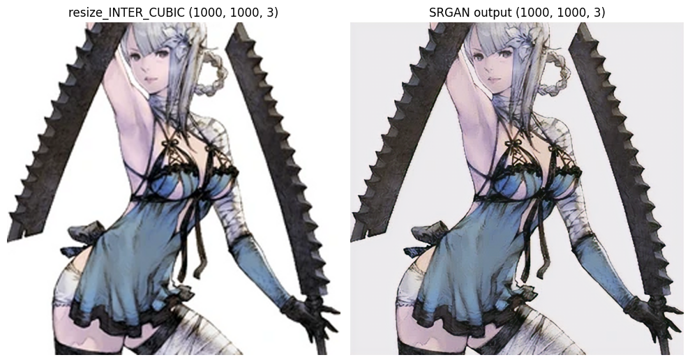

# SRGan Tensorflow
A simple Tensorflow 2.16 implementation of SRGAn - Train and Test

### Preparation
- Clone this repository
- Install requirements with ->  `pip install -r requirements.txt`
- Download dataset from [DIV2K](https://data.vision.ee.ethz.ch/cvl/DIV2K/) or by running ->  `python download_dataset.py`
- You can visualize the dataset is correctly loaded in ->  `test_dataloaders.ipynb`
### Training
- For an example of training you can refer to ->  `train_srgan_GPU.ipynb`
- You can tweak most of the hyperparameters in the ->  `GPU_train_cfg.json`
### Testing
- For an example of testing you can refer to ->  `test_srgan.ipynb`
### Example Results:
Original input image: (250x250x3)

Output image: (1000x1000x3)

### References
- Original paper -> [Photo-Realistic Single Image Super-Resolution Using a Generative Adversarial Network](https://arxiv.org/abs/1609.04802)
#### Referenced Repositories
- https://github.com/tensorlayer/SRGAN
- https://pyimagesearch.com/2022/06/06/super-resolution-generative-adversarial-networks-srgan/

